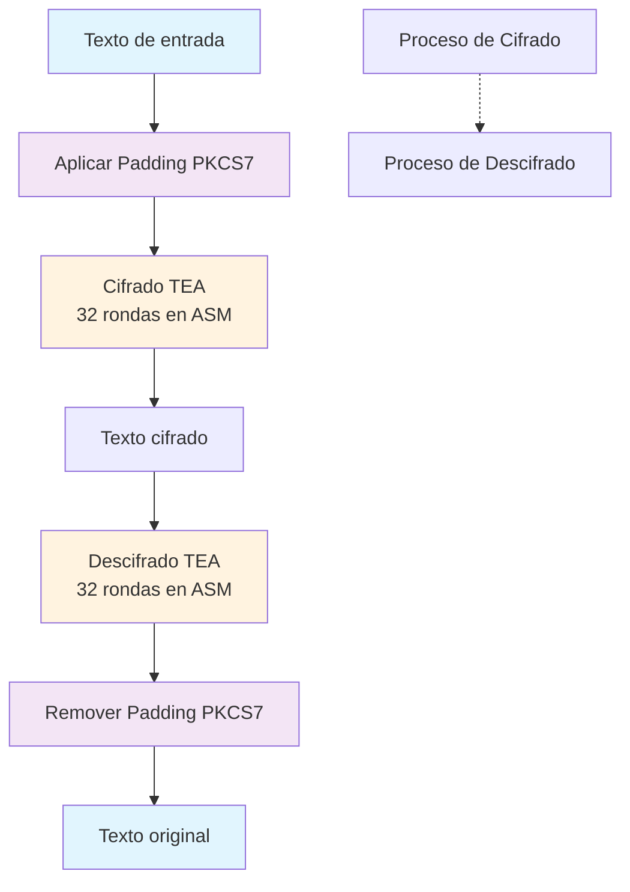

# 1. Descripción de la Arquitectura del Software

La arquitectura del proyecto se diseñó con una **separación clara entre las capas escritas en C y en ensamblador (ASM RV32)**, con el objetivo de garantizar legibilidad, modularidad y eficiencia en las operaciones críticas.  

## 1.1 Separación entre capas C y ensamblador

- **C (alto nivel):**  
  Se encarga de la gestión general de datos y de la interacción con el usuario. Aquí se implementan las funciones relacionadas con:
  - Manipulación de cadenas de texto (entrada y salida).
  - Procesamiento de la clave de 128 bits utilizada para el cifrado.
  - Aplicación de padding a la cadena de texto, asegurando la normalización del tamaño antes de encriptar.
  - Simulación de comunicación UART hacia la consola, empleada para la impresión de cadenas y caracteres.

- **Ensamblador RV32 (bajo nivel):**  
  Implementa las rutinas críticas de cifrado/descifrado mediante el algoritmo TEA (Tiny Encryption Algorithm). Al estar escrito directamente en ASM:
  - Se optimiza el uso de registros y operaciones aritméticas.  
  - Se asegura un mejor control sobre la manipulación de datos en memoria.  
  - Se aprovechan las instrucciones específicas de la arquitectura RISC-V para maximizar el rendimiento.
- **Conexión entre ambos niveles:**
Lo interconexión entre ambas capas de realiza en tiempo de compilación del proyecto C, donde mediante un *linker* se integran las funciones de ASM con el codigo compilado en C en un único ejecutable.

## 1.2 Interfaces utilizadas

La interacción entre las capas C y ensamblador se realiza mediante **funciones externas declaradas en C y definidas en ASM**.  
Este mecanismo permite que la lógica de alto nivel invoque directamente las operaciones críticas de cifrado sin perder control ni eficiencia.

En este caso, por ejemplo para la función "tea_encrypt_asm" se realizó la siguiente declaración externa en C:

```c
// Declaración en C
extern void tea_encrypt_asm(uint32_t* data, uint32_t* key);
```
Mientras que la función se definió en código ensamblador de la siguiente manera:

```asm
.globl tea_encrypt_asm
tea_encrypt_asm:
    # IMPLEMTENTACIÓN ...
```
De esta forma:

El código en C prepara los datos y gestiona la memoria.

El ensamblador se encarga de procesarlos con las rutinas de bajo nivel.

## 1.3 Justificación de las decisiones de diseño

Modularidad: Separar la lógica de alto nivel (C) de las rutinas de cifrado (ASM) facilita la comprensión, depuración y futura ampliación del proyecto.

Eficiencia: El cifrado requiere operaciones repetitivas y bit a bit, que se ejecutan de forma más eficiente en ensamblador optimizado.

Portabilidad: Al mantener la gestión de cadenas y la lógica general en C, el código puede adaptarse fácilmente a otros entornos o arquitecturas.

Simulación realista: La emulación de UART en C permite verificar el comportamiento del sistema de salida sin necesidad de hardware físico adicional.


# 2. Explicación técnica y detallada de las funcionalidades implementadas

En esta sección se describen de forma técnica las funcionalidades desarrolladas en el proyecto, diferenciando aquellas implementadas en **C** (alto nivel) y en **ensamblador RV32** (bajo nivel).  

---

## 2.1 Funcionalidades en C

El lenguaje C se utilizó principalmente para el **procesamiento de cadenas de texto**, la normalización de datos y la simulación de salida por consola. Las funciones implementadas son las siguientes:

- **Padding PKCS7**  
  - Ajusta el tamaño del bloque de texto de entrada para que sea múltiplo de 64 bits (8 bytes).  
  - Rellena con el valor del número de bytes añadidos, siguiendo el estándar PKCS7.  
  - Ejemplo:  
    - Texto original: `HELLO` (5 bytes).  
    - Padding: se añaden `03 03 03` → total 8 bytes.  

- **Unpadding PKCS7**  
  - Revierte el proceso de padding eliminando los bytes añadidos.  
  - Permite restaurar la cadena original tras el descifrado.  

- **printChar**  
  - Imprime un único carácter en la consola, simulando la transmisión por **UART**.  

- **printString**  
  - Imprime cadenas completas de texto, carácter por carácter.  
  - Sirve como base para la comunicación de resultados hacia el usuario.  

- **printHexa**  
  - Convierte un valor numérico en su representación hexadecimal.  
  - Es utilizado principalmente para mostrar los bloques cifrados y la clave.  

- **printAscii**  
  - Presenta la salida en formato ASCII legible.  
  - Facilita la verificación visual de los resultados y depuración.  

---

## 2.2 Funcionalidades en ensamblador RV32

El código ensamblador implementa las funciones críticas de **cifrado y descifrado**, siguiendo el algoritmo **TEA (Tiny Encryption Algorithm)**.  

- **Cifrado (enc):**  
  - Entrada: bloque de datos `V` de **64 bits** dividido en dos mitades de 32 bits (`V0`, `V1`), y una clave `K` de **128 bits** (4 palabras de 32 bits).  
  - Proceso:  
    - Se realizan **32 rondas** de operaciones aritméticas y bit a bit.  
    - Se emplea la constante **delta (φ, número áureo fraccionario)** para evitar simetrías y patrones en los bloques.  
    - En cada ronda se actualizan las mitades de `V` utilizando sumas, corrimientos y operaciones XOR con fragmentos de la clave.  

- **Descifrado (dec):**  
  - Inverso del proceso de cifrado.  
  - Se utilizan las mismas 32 rondas, restando el delta acumulado en lugar de sumarlo.  
  - El resultado es el bloque original de 64 bits antes de aplicar padding.  

- **Características clave del TEA en este proyecto:**  
  - **Simplicidad:** el algoritmo usa únicamente sumas, corrimientos y XOR, lo que lo hace ideal para implementación en ensamblador RISC-V.  
  - **Eficiencia:** al trabajar directamente con registros de 32 bits, se reduce la sobrecarga de memoria.  
  - **Seguridad básica:** aunque TEA no es el algoritmo más robusto frente a ataques modernos, es muy útil como ejercicio de criptografía y optimización en bajo nivel.  

---

## 2.3 Interacción entre C y ASM

1. El código en **C** prepara el bloque de datos (texto + padding) y la clave de 128 bits.  
2. Mediante una **interfaz externa** (`extern`) llama a las funciones `enc` o `dec` implementadas en ASM.  
3. Los resultados (bloques cifrados o texto descifrado) se devuelven a C para ser impresos con las funciones de salida (`printHexa`, `printAscii`).  

---

## 2.4 Diagrama funcional



# 3. Documentación de evidencias de ejecución de GDB y QEMU

En esta sección se presentan las pruebas realizadas para validar el correcto funcionamiento del sistema utilizando **QEMU** como emulador de la arquitectura RISC-V y **GDB** como depurador.  

---

## 3.1 Ejecución en QEMU

Para ejecutar el programa compilado en formato `.elf`, se utiliza el script **`run-quemu.sh`**, el cual inicializa QEMU con los parámetros adecuados de máquina virtual, sin interfaz gráfica y con salida redirigida a consola.  

Al ejecutar el script, se observa la salida mostrada en la **Figura 1**.  

📌 *Figura 1: Ejecución del programa en QEMU (insertar captura aquí).*  

---

## 3.2 Ejecución en GDB

Para la depuración, se dispone del script **`run-gdb.sh`**, el cual automatiza:  
- La conexión remota con el servidor de QEMU.  
- La configuración de breakpoints iniciales.  
- La visualización de registros y código en ASM.  

Si bien el uso de este script es opcional, se recomienda su ejecución para agilizar el proceso de depuración.  

La vista obtenida se muestra en la **Figura 2**, donde se aprecian:  
- Los registros de la CPU.  
- El código ensamblador cargado.  
- Los breakpoints establecidos.  

📌 *Figura 2: Ejecución de GDB conectado a QEMU (insertar captura aquí).*  

---

## 3.3 Ejecución de los ejemplos propuestos

Se realizaron pruebas de cifrado y descifrado con diferentes configuraciones de entrada para validar el correcto funcionamiento del algoritmo TEA en conjunto con el sistema de padding/unpadding.  

### Prueba 1 – Bloque único
- **Entrada:** cadena `HOLA1234` (exactamente 64 bits).  
- **Clave utilizada:**  0x12345678 
0x9ABCDEF0, 0xFEDCBA98, 0x76543210
- **Proceso:**  
- La cadena se pasa directamente al algoritmo TEA (no requiere padding).  
- Se aplica el proceso de cifrado (32 rondas).  
- Posteriormente se descifra el bloque.  
- **Resultado esperado:**  
El bloque descifrado debe coincidir exactamente con la cadena original `HOLA1234`.  

### Prueba 2 – Múltiples bloques
- **Entrada:** cadena `Mensaje de prueba para TEA`.  
- **Clave utilizada:** clave arbitraria válida de 128 bits.  
- **Proceso:**  
- El sistema aplica **padding PKCS7** para ajustar el tamaño del mensaje a múltiplos de 64 bits.  
- Cada bloque es cifrado de manera independiente mediante TEA.  
- Los bloques cifrados son luego descifrados en orden, aplicando unpadding al resultado.  
- **Resultado esperado:**  
La cadena descifrada debe coincidir con el mensaje original `Mensaje de prueba para TEA`, confirmando el correcto funcionamiento del sistema de relleno y descifrado.  

---

